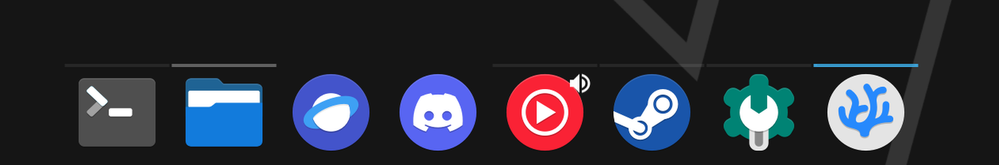

# Breeze-Transparent

Standard KDE breeze plasma style but with transparent panels

## Usage
To use drop whole folder into `~/.local/share/plasma/desktoptheme` and select in plasma styles in customization

## Note
If there are jagged corners on the edges of the panel you may need to go to
`Settings > Window Management > Desktop Effects` and disable Blur or Background Contrast
